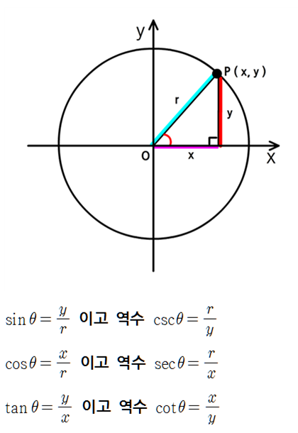

## CANVAS에 점과 점을 연결하여 경로 그리기
### 1. 캔버스 그리기
```js
const canvas = Object.assign(document.createElement('canvas'), {id: 'canvas'});
const ctx = canvas.getContext('2d');
canvas.width = 500;
canvas.height = 500;
document.body.appendChild(canvas);
```

### 2. 캔버스 위에 시작 점 기준으로 삼각함수를 이용하여 다음 점 위치 계산해서 그리기


```
x = cos(θ) * 길이(r)
y = sin(θ) * 길이(r)
```
자바스크립트 cos, sin 함수를 이용해서 좌표 계산하기

```js
const r = 100;
const theta = Math.random() * 180;
const DEG = Math.PI/180;
const startX = 50;
const startY = 50;
ctx.beginPath();
ctx.arc(startX, startY, 5, 0, 360, false);
ctx.fill();

const sin = Math.sin(DEG*theta) * r;
const cos = Math.cos(DEG*theta) * r; 
const nextX = sin + startX;
const nextY = cos + startY;

ctx.beginPath();
ctx.arc(nextX, nextY, 5, 0, 360, false);
ctx.fill();

ctx.beginPath();
ctx.moveTo(startX, startY);
ctx.lineTo(endX, endY);
ctx.stroke();
```

캔버스에서 X로 50, Y로 50 이동된 위치에 반지름 5인 점을 먼저 그리고, 시작점 기준으로 각도를 랜덤으로 계산하여 다음 점을 그려서 선을 연결한다.     
위 코드를 정리해서 점 데이터를 생성하는 함수와, 점의 위치를 계산하는 함수로 크게 나눌 수 있다.

### 3. 점을 노드라고 칭하고 점 노드 데이터를 생성하는 함수와, 점 노드 위치 값을 계산하는 함수 만들기
* 노드 인스턴스 만들기
> 시작 점과, 끝 점을 연결해서 시작 점 위치 기준으로 세타(각도)에 따라 끝 점을 그려야하기 때문에 시작 점의 좌표를 알기 위해서 class 를 사용한다.
```js
class Node {
  x;
  y;
  connected = new Set; // 인스턴스 만들어진 점 노드 저장소
  static store = new Set;
  constructor(x, y){
    this.x = y;
    this.y = y;
    Node.store.add(this);
  }
  connect(node){
    this.connected.add(node);
    node.connected.add(this);
  }
}
```
* 시작 점 노드 기준으로 다음 점을 생성하여 좌표 계산하는 함수 
```js
const DEG = Math.PI/180;
const extend = (node) => { // 매개변수 시작 점 노드
  const r = 100;
  const theta = Math.random() * 180;
  const cos = Math.cos(DEG*thera) * r; //x
  const sin = Math.sin(DEG*thera) * r; //y
  const nextNode = new Node(node.x + cos, node.y + sin);
  return {start: node, end: nextNode};
}
```

* 점 노드 데이터를 생성하는 함수
```js
const createStruct = (node, length) => {
  for(let i = 0; i < length; i++){
    [...Node.store].forEach(node => extend(node));
  }
  return node;
}
```


